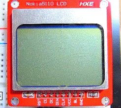

# mruby-esp32-nokia5110

 Nokia 5110 (PCD8544) LCD library for mruby-esp32.

This library is a for the PCD8544 based 48x84 pixel LCD display running on the mruby-esp32.


# Installation

Add the following line below to your `esp32_build_config.rb`:

```ruby
  conf.gem :github => 'icm7216/mruby-esp32-nokia5110'
```

# Usage

Example of controlling the LCD display with PCD8544 controller.

### Demo movie




SPI Wiring
```
Nokia5110       NodeMCU-32S(ESP32)
      RST ----> GPIO 17 Reset   
       CE ----> GPIO  5 Chip Select 
       DC ----> GPIO 16 Data/Command select
      DIN ----> GPIO 23 MOSI
      CLK ----> GPIO 18 SCK (SPI Clock) 
      VCC ----> 3v3 (3.3V)
       BL ----> ---[470 ohm]---->[3V3] (LED Back Light)
      GND ----> GND
```

The default setting is to use DMA Channel 1, VSPI host, SPI mode 0, and the SPI clock frequency of 4 MHz. This setting is the same as the following initialization command.

Note: The clock speed is [Hz].
``` ruby
# default setting
lcd = LCD::NOKIA5110.new(sck: 18, mosi: 23, rst: 17, dc: 16, cs: 5, freq: 4000000, dma_ch: 1, spi_mode: 0)

# same as default
lcd = LCD::NOKIA5110.new()
```

In advance, you will need to add several mrbgems to `esp32_build_config.rb`
```ruby
  conf.gem :core => "mruby-math"
  conf.gem :core => "mruby-proc-ext"
  conf.gem :core => "mruby-toplevel-ext"
  conf.gem :github => "mruby-esp32/mruby-esp32-system"
```

### Note:

*   CS line is active-low signal. If assign another GPIO pin to use the second CS line, the initial setting of the second CS line must be HIGH level. This is important when connecting multiple devices to the same SPI bus.
*   GPIO2, GPIO4, and GPIO12 pins are pulled down with default settings after reset.  
See also: `4.10 IO_MUX Pad List` in the [ESP32 Technical Reference Manual](https://www.espressif.com/sites/default/files/documentation/esp32_technical_reference_manual_en.pdf)


In this case, the following command will help.
``` ruby
include ESP32::GPIO
second_cs_line = 4
pinMode(second_cs_line, OUTPUT)
digitalWrite(second_cs_line, HIGH)

lcd1 = LCD::NOKIA5110.new()
lcd2 = LCD::NOKIA5110.new(cs: second_cs_line)
```

# Code
```ruby
lcd = LCD::NOKIA5110.new()
lcd.clear

msg = ["Hello", "mruby", "mruby", "ESP32"]
lcd.fontsize = 1
lcd.text( 0, 5, msg[0])
lcd.text(44, 5, msg[1])
lcd.fontsize = 2
lcd.text( 0, 31, msg[2])
lcd.text(44, 31, msg[3])
lcd.display
ESP32::System.delay(1000)
lcd.clear

lcd.rect(0, 0, 84, 48)
lcd.vline(42, 5, 38)
lcd.hline(21, 24, 41)
lcd.circle(42, 24, 20)
lcd.fill_circle(12, 24, 8)
lcd.fill_rect(66, 16, 15, 15)
lcd.display
ESP32::System.delay(1000)
lcd.clear

lcd.color = LCD::WHITE
x = 0
6.times do |n|
  fontsize = n + 1
  w = 8 * ((fontsize.div 2) + (fontsize & 0x01))
  x = x + 8 * (fontsize.div 2)
  lcd.fontsize = fontsize
  lcd.text(x, 0, fontsize.to_s)
end
lcd.display
ESP32::System.delay(1000)
lcd.clear

# drawing Spirograph
rc = 11                           # Radius of the constant circle
rm = 6                            # Radius of the motion circle
rd = 9                            # Radius of the Drawing point
x_offset = 42
y_offset = 24

# trochoid functions
fx = ->(t){(rc + rm) * Math.cos(t) - rd * Math.cos(t * (rc + rm) / rm) + x_offset}
fy = ->(t){(rc + rm) * Math.sin(t) - rd * Math.sin(t * (rc + rm) / rm) + y_offset}

# greatest common divisor
def my_gcd(a, b)
  a, b = b, a % b while b > 0
  a
end

laps = rm / my_gcd(rc,rm)         # Number of laps
to = 2.0 * Math::PI * laps        # rotation angle
div = 0.2                         # angle
theta_end = (to + div).div div    # Drawing end angle

theta_end.times do |i|
  x0 = fx[div * i]
  y0 = fy[div * i]
  x1 = fx[div * (i + 1)]
  y1 = fy[div * (i + 1)]
  lcd.line(x0, y0, x1, y1)
  lcd.display
  GC.start 
end
```


# Using library

**Many thanks!**

*   8x8 monochrome bitmap fonts from font8x8_basic.h by [dhepper/font8x8](https://github.com/dhepper/font8x8)
*   graphics libraries are adapted from OLEDDisplay.cpp by [squix78/esp8266-oled-ssd1306](https://github.com/squix78/esp8266-oled-ssd1306)


# License

MIT
